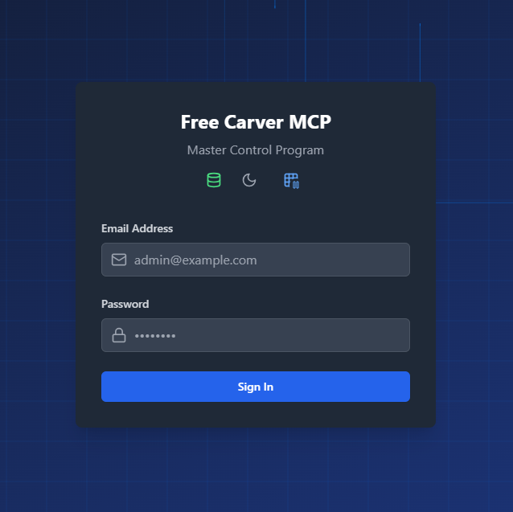
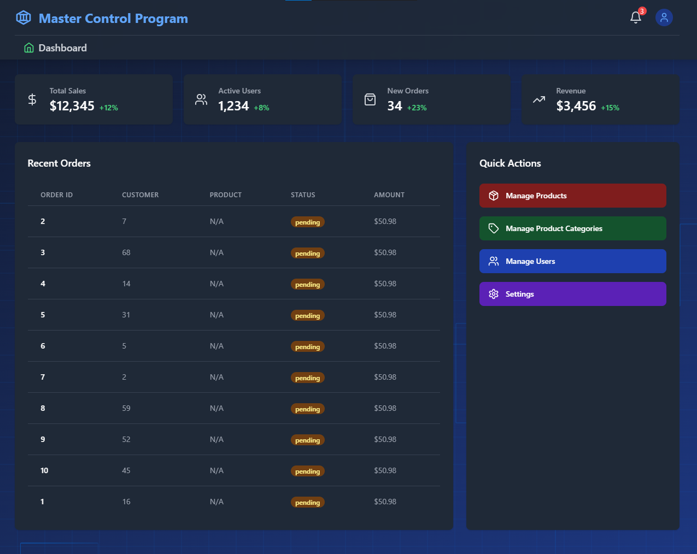
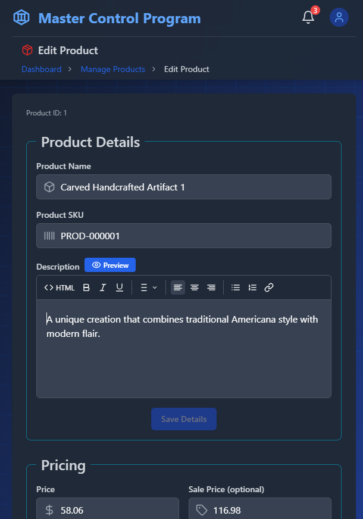
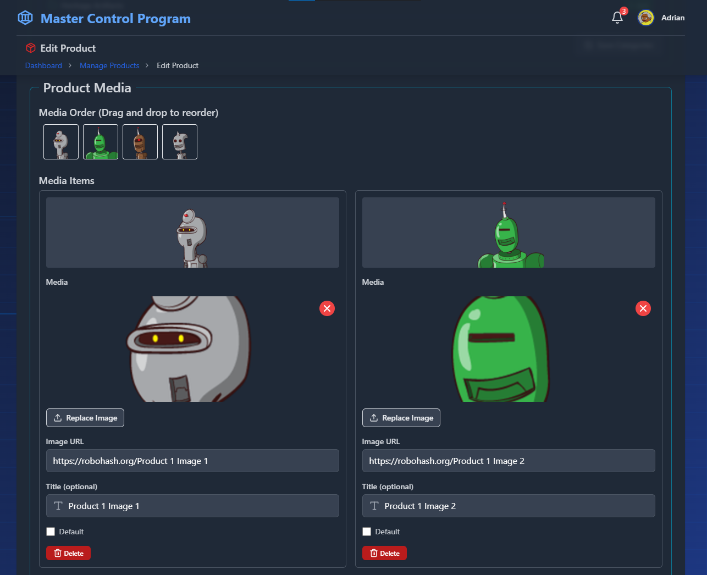

# FreeCARVER MCP

FreeCARVER MCP (Master Control Program) is a modern full-stack e-commerce management system built with React, TypeScript, and Node.js. This project serves as a personal portfolio piece, designed by the author to explore and implement the latest AI development tools while mastering modern best practices in React, Node.js, PostgreSQL, and full-stack development, soley for his personal continuing education.

### It is a development tool in continuing development. Please note that it may be broken at any given moment.

If you wish to expand on the project feel free to clone or fork it for your own purposes.

## 🎯 Project Purpose

This project was created as a learning platform to:
- Explore and implement the latest AI development tools and practices
- Master modern React patterns and best practices
- Deepen understanding of TypeScript in full-stack development
- Implement robust backend architecture with Node.js and Express
- Learn advanced PostgreSQL database design and optimization
- Practice modern DevOps and deployment strategies
- Implement comprehensive testing methodologies

## Screenshots








## 🚀 Features

### User Management
- Role-based access control (Admin/Customer)
- Secure authentication with JWT
- User profile management
  - Personal details
  - Account preferences
  - Avatar management
  - Email and password updates
- Admin dashboard for user management

### Product Management
- Comprehensive product catalog
  - Product details and descriptions
  - Rich media management
  - Category organization
  - Variant and option management
- Inventory tracking
- Pricing management
- Product media gallery with drag-and-drop support

### Order Management
- Complete order processing system
- Customer management
- Shipment tracking
- Recent orders dashboard
- Order status management

### System Features
- Modern UI/UX with Tailwind CSS
- Dark/Light theme support
- Toast notifications
- Modal dialogs
- Image upload with preview
- Pagination
- Dashboard with quick actions
- Rich text editing with TipTap
- Drag and drop functionality

## 🛠️ Tech Stack

### Frontend
- React 18 with TypeScript
- Vite for build optimization
- TipTap Editor for rich text editing
- React Router DOM for navigation
- Tailwind CSS for styling
- Hello Pangea DND for drag-and-drop
- Lucide React for icons
- Date-fns for date manipulation

### Backend
- Node.js with Express
- PostgreSQL for data storage and authentication
- Joi for request validation
- RESTful API architecture
- JWT for authentication

### Development Tools
- ESLint for code quality
- Prettier for code formatting
- TypeScript for type safety
- Vite for fast development
- PostCSS for CSS processing
- Tailwind CSS for utility-first styling

## 📦 Installation

1. Clone the repository:
```bash
git clone [repository-url]
cd freecarver-mcp
```

2. Install dependencies for both frontend and backend:
```bash
# Install frontend dependencies
npm install

# Install backend dependencies
cd api
npm install
```

3. Set up environment variables:
```bash
# Copy the example env file
cp .env.sample .env
# Do the same for the API
cd api
cp .env.test .env
```

4. Configure your environment variables in both `.env` files according to your setup.

## 🐘 PostgreSQL Setup

### Local Development Setup

1. Install PostgreSQL on your system:
```bash
# Ubuntu/Debian
sudo apt update
sudo apt install postgresql postgresql-contrib

# macOS (using Homebrew)
brew install postgresql@14
brew services start postgresql@14
```

2. Create a new PostgreSQL user and database:
```bash
# Switch to postgres user
sudo -i -u postgres

# Create a new user (replace 'your_username' with your desired username)
createuser --interactive --pwprompt your_username

# Create a new database (replace 'your_database' with your desired database name)
createdb your_database

# Exit postgres user shell
exit
```

3. Update your `.env` file with the database credentials:
```bash
DB_USER=your_username
DB_PASSWORD=your_password
DB_NAME=your_database
DB_HOST=localhost
DB_PORT=5432
```

4. Run database migrations:
```bash
cd api
npm run migrate
```

5. Create a super admin user:
```bash
# Using tsx to run TypeScript files directly
npx tsx scripts/create-super-admin.ts
```

### Troubleshooting

- If you encounter permission errors, ensure your PostgreSQL user has the necessary privileges:
```bash
# As postgres user
sudo -i -u postgres
psql

# In psql shell
GRANT ALL PRIVILEGES ON DATABASE your_database TO your_username;
\q
exit
```

- If migrations fail, check that your database user has the correct permissions and that the database exists.

## 🚀 Running the Application

### Development Mode

1. Start the frontend development server:
```bash
npm run dev
```

2. In a separate terminal, start the backend server:
```bash
cd api
npm start
```

### Production Build

1. Build the frontend:
```bash
npm run build
```

2. Preview the production build:
```bash
npm run preview
```

## 🧪 Testing and Quality Assurance

The project includes comprehensive testing and quality assurance tools:
- ESLint for code quality
- TypeScript for type safety
- Request validation with Joi
- Error handling middleware
- Input sanitization

Run the linter with:
```bash
npm run lint
```

## 📁 Project Structure

```
├── src/                  # Frontend source files
│   ├── components/       # React components
│   │   ├── User/        # User management components
│   │   ├── Product/     # Product management components
│   │   └── Common/      # Shared UI components
│   ├── pages/           # Page components
│   ├── hooks/           # Custom React hooks
│   ├── utils/           # Utility functions
│   ├── types/           # TypeScript type definitions
│   └── lib/             # Library code
├── api/                 # Backend API
│   ├── routes/          # API routes
│   │   ├── v1/         # Version 1 API endpoints
│   │   └── v2/         # Version 2 API endpoints
│   ├── middleware/      # Express middleware
│   ├── services/        # Business logic
│   ├── validators/      # Request validation
│   └── utils/           # Utility functions
├── migrations/          # Database migrations
└── scripts/            # Utility scripts
```

## 🤝 Contributing

While this is primarily a learning portfolio project, contributions and suggestions are welcome:

1. Fork the repository
2. Create your feature branch (`git checkout -b feature/amazing-feature`)
3. Commit your changes (`git commit -m 'Add some amazing feature'`)
4. Push to the branch (`git push origin feature/amazing-feature`)
5. Open a Pull Request

## 📄 License

This project is licensed under the MIT License.

MIT License

Copyright (c) 2024

Permission is hereby granted, free of charge, to any person obtaining a copy
of this software and associated documentation files (the "Software"), to deal
in the Software without restriction, including without limitation the rights
to use, copy, modify, merge, publish, distribute, sublicense, and/or sell
copies of the Software, and to permit persons to whom the Software is
furnished to do so, subject to the following conditions:

The above copyright notice and this permission notice shall be included in all
copies or substantial portions of the Software.

THE SOFTWARE IS PROVIDED "AS IS", WITHOUT WARRANTY OF ANY KIND, EXPRESS OR
IMPLIED, INCLUDING BUT NOT LIMITED TO THE WARRANTIES OF MERCHANTABILITY,
FITNESS FOR A PARTICULAR PURPOSE AND NONINFRINGEMENT. IN NO EVENT SHALL THE
AUTHORS OR COPYRIGHT HOLDERS BE LIABLE FOR ANY CLAIM, DAMAGES OR OTHER
LIABILITY, WHETHER IN AN ACTION OF CONTRACT, TORT OR OTHERWISE, ARISING FROM,
OUT OF OR IN CONNECTION WITH THE SOFTWARE OR THE USE OR OTHER DEALINGS IN THE
SOFTWARE.

## 📫 Support

For support or to discuss the project, please contact the project maintainer.

## 🎓 Learning Resources

This project was built using various learning resources and documentation:
- React Documentation
- TypeScript Handbook
- Node.js Documentation
- PostgreSQL Documentation
- Express.js Guide
- Various AI development tools documentation 